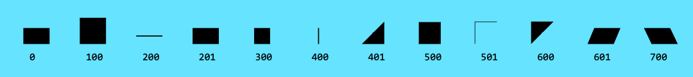

# piksels


## inside ufo
### glyphset
- characters
- pixels


### pixels
- general idea
- naming

### features
- classes
- lookups
- rvrn

###### do this
Make a glyph named 'pixel'. This is just a temporarly shape to draw the font. 
Draw the characters with this pixel-component. Use PixelTools.

The main character set has no suffix and has unicodes.
Extra character sets must have a suffix, eg: 'A.heavy'.

The pixels that end up in the variable font are named 'pixel.#' where # is a value, starting at 0 and the end is up to you. 
example:


Keep in mind that all these pixels need to interpolate! By putting two values right next to each other (400,401) it will look like a pixel switch.

###### fea
Of course switch character sets has nothing to do with interpolation, so we need to do some technical stuff.

- every character set need to gets a `class` in the features
- make a `lookup` for every suffixed set
- make a `feature rvrn` and populate it with a substitution of the second set by the first (default)


##### classes
```  
@default = [A B C];
@heavy =   [A.heavy B.heavy C.heavy];
@other =   [A.other B.other C.other]; 
```
##### lookups
```
lookup heavy {
  sub @default by @heavy;
} heavy;

lookup other {
  sub @default by @other;
} other;
```
##### feature
```
feature rvrn {
  sub @heavy by @default;
} rvrn;
```

note: if this is the order of things in the features (first the lookups than the feature), the GSUB table is also ordered in this way. Meaning at index 0 in the table we find the first substitution we are interested in.

note2: of course if you add more features to the font the indexes could be very different. your own risk ;-)


## script

The script generates:
- a **designspace document** according to your parameters, 
- all the **sources** as .ufoz,
- **FeatureVariations.ttx** to get the switching character set axis work.


The number of sources can grow very quickly.
example: if you want a axis propartion default-condensed, and an axis with forward slant, and you have 4 pixels;
2 x 2 x 4 = 16 sources
If you add rotation with 12 steps per full circle in it grows to 16 x 12.
etc.


### parameters desingspace

**on / off**

The following parameters are booleans. Choose what is in the designspace.

- slant
	- forward
	- backward 	
- proportion
	- condensed
	- expanded
- rotation
- character set (if you have multiple sets)

**values**

**slant**

_How much the pixel in the next row will shift in pixel-widths_
slantFactor = 1 

slantAxisMax = 50 


**proportion**

condensedFactor = .5

expandedFactor = 1.5

proportionAxisMin = 50

proportionAxisMax = 150


**rotate**

rotationSteps = 12


**pixels**

_What is the value of the max pixel in the font, e.g. pixel.**830**_

- max pixel

## generate a font
Compile a variable font via the designspace.
I find it very handy to do this with the help of a `Makefile`.
Open the project in Terminal and `make`.

If you open your variable font now in ~your favorite variable font viewer~, you see all works except the Character Set Axis.
**warning very technical part starts here**
This is because the FeatureVariations need to get into the GSUB table.

This is what needs to be done:

- extract GSUB table from the font
- edit it, add FeatureVariations
- merge the new GSUB table back into the font

I'll make it as easy as possible: the Makefile does the extract and merge part.

in Terminal do: `make g`
In the project folder a `GSUB.ttx` appears. Open it.

First set the Version at line 5 to:     
\<Version value="0x0001000**1**"/>

Add the bottom of the file, between 
`</LookupList>` and   `</GSUB>` we need the add the FeatureVariations.
Open FeatureVariations.ttx and copypaste the content here.

Save and close
Back in Terminal: `make m` to merge the files

Done!

## use it!
css and stuff

## make changes! easy!
Whenever you have your working variable font, and your editted GSUB.ttx, its easy to make changes in the pixel line up. This does not effect the GSUB table. So if you add an extra pixel, all you need is `make` and `make m`. When you add a new character set, then you need to go through all steps (add the class and lookup, recompile GSUB etc.)

