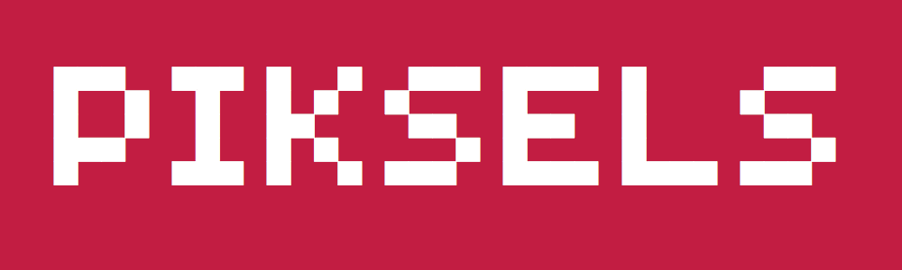

# Piksels


### make a variable font with pixels
I want to teach you how you can make your own variable pixel fonts in kinda a workshop way.

### basic
Everyone with a basic type design knownledge should understand it. I will provide resources and examples.


<!-- next section for later? -->
<!--
### advanced
Additionally, I can explain how non-interpolating variable fonts work. This is very technical and it is not entry level type design stuff.
--> 


You need:

- A Mac.
- A font editor. I use [RoboFont](https://robofont.com/) with the [PixelTool extension](https://github.com/typemytype/pixelToolRoboFontExtension). 
- [fontmake] (https://github.com/googlefonts/fontmake)

### How to

1. Create a pixel
2. Draw a font
3. Create interpolating pixels
4. Create a variable font


## Draw a pixel
Make a new font and create a glyph named 'pixel'
Draw a shape near or at the origin.
This is just a pixel to draw the font, no fancy looking shape is required, just a rectangle will do.

``` python
# in code it looks like
# create a new font, create a glyph, draw a shape
f = NewFont("Piksels", "mystyle")
g = f.newGlyph("pixel")
pen = g.getPen()
d = 100
pen.moveTo((0,0,))
pen.lineTo((d,0))
pen.lineTo((d,d))
pen.lineTo((0,d))
pen.closePath()
```

## Draw a font
If not already present, add some basic glyphs to the font:

``` python
# this script add template glyphs A-Z to the CurrentFont
import string
basicCaps = string.ascii_uppercase

f = CurrentFont()
glyphOrder = list(f.lib['public.glyphOrder'])
for glyphName in basicCaps:
    if glyphName not in glyphOrder:
        glyphOrder.append(glyphName)
f.glyphOrder = glyphOrder
```

Open a glyph, select PixelTool, right-click in the GlyphView and set the correct settings: Set Component to 'pixel' and the Pixel Size = 100 if you followed the example above. If you drew a smaller/larger pixel, than use your size!

Now it is just drawing. 

## Create interpolating pixels
In this example I create 4 pixels. 

``` python
newPixels = [
  'pixel.0',
  'pixel.100',
  'pixel.101',
  'pixel.200',
]
f = CurrentFont()
glyphOrder = list(f.lib['public.glyphOrder'])
for glyphName in newPixels:
    if glyphName not in glyphOrder:
        glyphOrder.append(glyphName)
f.glyphOrder = glyphOrder
```

The number after the period in the glyph name, will be the location on the variable axis later.

Keep in mind that all these pixels need to interpolate. You can 'trick' the system to place two location right next to each other, like I did: 100,101.

Place an anchor in the glyph. This will be the rotating point for the rotate axis. 

See the `Example.ufoz` for an -well- example.

## Create a variable font
super easy: 

1.	Run the script `HalloType_Piksels_mainScript.py`: open it in RoboFont, have the font open and make sure it is the CurrentFont. 
At the top of the script there are some parameters for the axes you can add the variable font. 
Run the script. The script will analyse the font and create `Piksels.designspace`. Also, all the sources for the designspace will be generated in the `sources` folder.
2. Open the project folder in Terminal and type `make`. Now the variable font is generated! Find **Piksels.ttf** in the folder!
3. Done! 

## What now?
Soon: DrawBot variable font tutorial.


